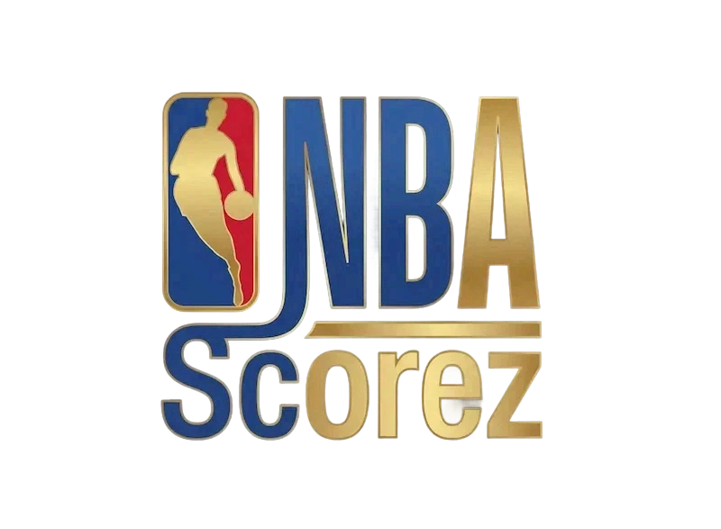
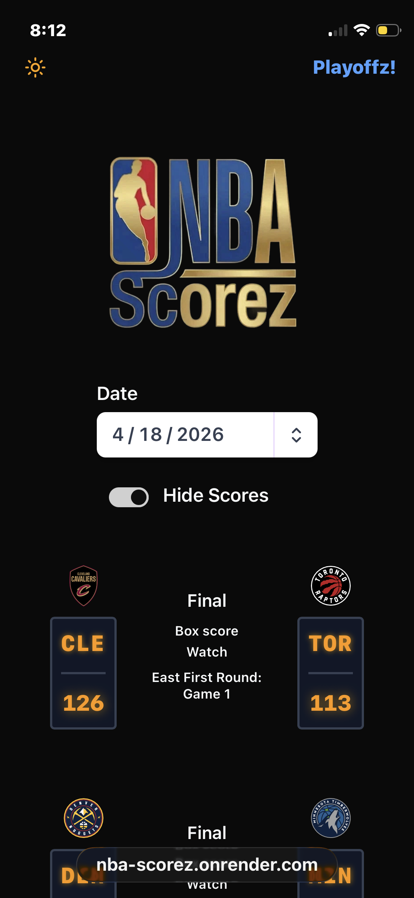
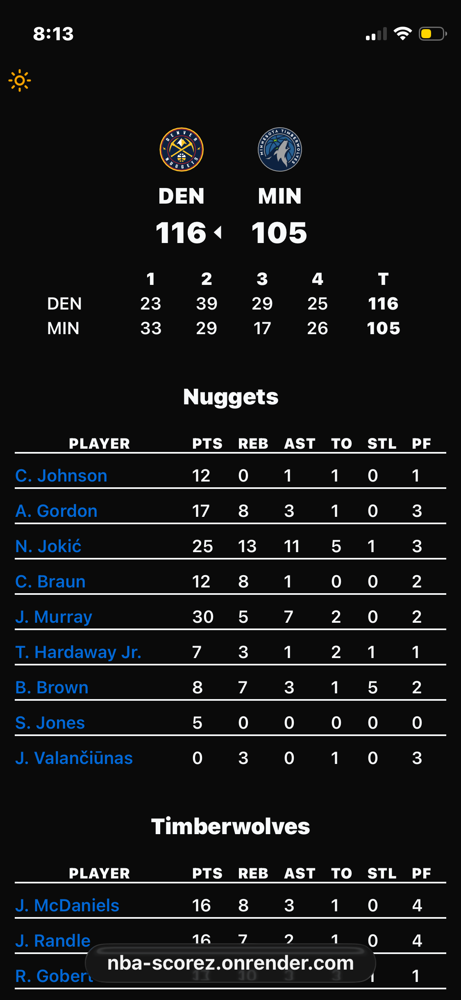
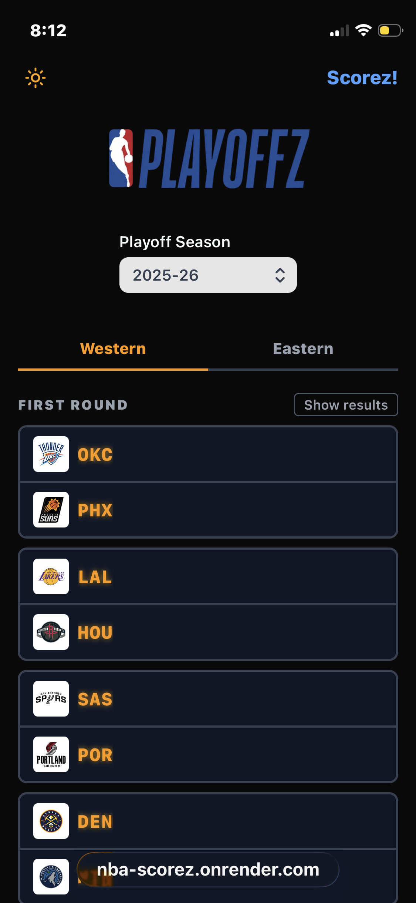
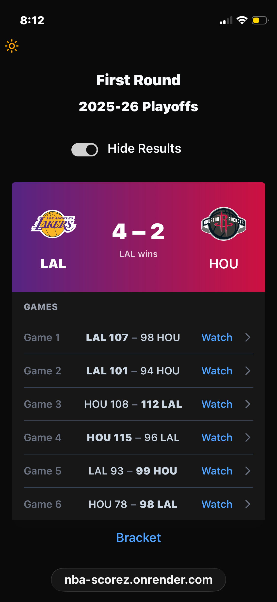

[![alex-linkedin-shield]][alex-linkedin-url]

<div align="center">
  
   <p align="center">
    Bienvenue! 
    <br />
    <a href="https://github.com/AlexVCS/nba-scores/issues/new">Report Bug</a>
  </p>
</div>

## Table of Contents

[About](#about) |
[Screenshots](#screenshots) |
[Playoffs](#playoffs) |
[Built With](#built-with) |
[Local Project Setup](#local-project-setup) |
[AI Agents](#ai-agents) |
[Clone the repo](#clone-the-repo) |
[Contact](#contact)

## About

Find the scores and stats of your favorite NBA team! Scorez, boxscores, and playoff data go back to the 1946/47 season.

## Screenshots

<table>
  <tr>
    <th>Scorez App</th>
    <th>Boxscore</th>
  </tr>
  <tr>
    <td align="center">
      
    </td>
    <td align="center">
      
    </td>
  </tr>
  <tr>
    <th>Playoffz</th>
    <th>Series Detail</th>
  </tr>
  <tr>
    <td align="center">
      
    </td>
    <td align="center">
      
    </td>
  </tr>
</table>

## Playoffs

Navigate to the [Playoffs](https://nbascorez.com/playoffs) page to explore interactive bracket visualizations.

- Select any season with the year picker
- Toggle results round by round to avoid spoilers
- Click any series to see a game-by-game breakdown with scores, dates, and links to box scores
- Watch links are available for seasons from 2012/13 onward, depending on League Pass availability
- On desktop, the bracket is rendered with [React Flow](https://reactflow.dev/)

<div align='right'>

[Back to Top](#top)

</div>

## Built With

[![React.JS]][React-url][![Tailwindcss]][Tailwind-url][![TypeScript]][Typescript-url][![FastAPI]][FastAPI-url]

<div align='right'>

[Back to Top](#top)

</div>


</div>

## Local Project Setup

Git, Node.js, Python, and PNPM (or your package manager of choice) are required to run this project locally. 

## AI Agents

AI coding agents from [OpenAI](https://openai.com) and [Anthropic](https://anthropic.com) assisted in writing code throughout this project.

<div align='right'>

[Back to Top](#top)

</div>

### Clone the repo

Copy this and run it in your terminal:

```bash
git clone https://github.com/AlexVCS/nba-scores.git
cd nba-scores
pnpm i
```

Run the frontend by running `pnpm dev` in one terminal.

To run the backend, open a terminal and run this:

```bash
source server/venv/bin/activate
uvicorn server.main:app --reload
```

## Contact

Alex Curtis-Slep - [GitHub](https://github.com/AlexVCS) / [Bluesky](https://bsky.app/profile/alexcurtisslep.bsky.social) / alexcurtisslep@gmail.com

<div align='right'>

[Back to Top](#top)

</div>

[alex-linkedin-shield]: https://img.shields.io/badge/-Alex's_LinkedIn-black.svg?style=for-the-badge&logo=linkedin&colorB=555
[alex-linkedin-url]: https://www.linkedin.com/in/alexcurtisslep/
[FastAPI]: https://img.shields.io/badge/FastAPI-009485.svg?style=for-the-badge&logo=fastapi&logoColor=white
[FastAPI-url]: https://fastapi.tiangolo.com/
[React.js]: https://img.shields.io/badge/React-20232A?style=for-the-badge&logo=react&logoColor=61DAFB
[React-url]: https://reactjs.org/
[ReactFlow]: https://img.shields.io/badge/React_Flow-black?style=for-the-badge&logo=react
[ReactFlow-url]: https://reactflow.dev/
[Tailwindcss]: https://img.shields.io/badge/Tailwind_CSS-38B2AC?style=for-the-badge&logo=tailwind-css&logoColor=white
[Tailwind-url]: https://tailwindcss.com/
[Typescript]: https://img.shields.io/badge/typescript-%23007ACC.svg?style=for-the-badge&logo=typescript&logoColor=white
[Typescript-url]: https://www.typescriptlang.org/
