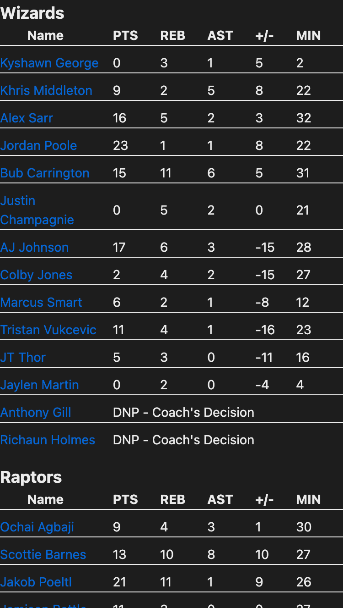

[![alex-linkedin-shield]][alex-linkedin-url]

<div align="center">
  
   <p align="center">
    Bienvenue! 
    <br />
    <a href="https://github.com/AlexVCS/nba-scores/issues/new">Report Bug</a>
  </p>
</div>

## Table of Contents

[About](#about) |
[Screenshots](#screenshots) |
[Built With](#built-with) |
[Local Project Setup](#local-project-setup) |
[Clone the repo](#clone-the-repo) |
<!-- [Mock an API Response](#mock-an-api-Response) | -->
[Contact](#contact)

## About

Find the scores and stats of your favorite NBA team! Boxscores are only available for games from the 2019/20 season, and after.

## Screenshots

Scores App UI                           |         Boxscore UI
:--------------------------------------:|:-------------------------:
  |  

## Built With

[![React.JS]][React-url][![Tailwindcss]][Tailwind-url][![Hono]][Hono-url][![TypeScript]][Typescript-url]

Design: https://www.figma.com/design/AQL6ywEUiKkconAcaX5upM/NBA-Website-(Community)?node-id=0-1&p=f&t=5BTVqqpQWaIF9b4f-0

<div align='right'>

[Back to Top](#top)

</div>

## Local Project Setup

Git, Node.js, and PNPM (or your package manager of choice) are required to run this project locally. 

### Clone the repo

Copy this and run it in your terminal:

```bash
git clone https://github.com/AlexVCS/nba-scores.git
cd nba-scores
pnpm i
```

Run the frontend by running `pnpm dev` in one terminal.

To run the backend, open a terminal and run this:

```bash
source server/venv/bin/activate
uvicorn server.main:app --reload
```

<div align='right'>

[Back to Top](#top)

</div>

<!-- ### Mock an API Response

If you'd like to see what the scores UI looks like without signing up for the API, or test the view in dev mode, run this in your terminal:

`npm run mock-api`

This runs a file at the root called `MockApiResponse.mjs` that edits `app/components/Scores.tsx` to no longer call the API and use `exampleResponse.json` as your data.

To undo these changes, run this command in your terminal:

`npm run call-api` -->

<!-- <div align='right'>

[Back to Top](#top)

</div> -->

## Contact

Alex Curtis-Slep - [GitHub](https://github.com/AlexVCS) / [Bluesky](https://bsky.app/profile/alexcurtisslep.bsky.social) / alexcurtisslep@gmail.com

<div align='right'>

[Back to Top](#top)

</div>

[alex-linkedin-shield]: https://img.shields.io/badge/-Alex's_LinkedIn-black.svg?style=for-the-badge&logo=linkedin&colorB=555
[alex-linkedin-url]: https://www.linkedin.com/in/alexcurtisslep/
[Hono]: https://img.shields.io/badge/Hono-black?style=for-the-badge&logo=hono
[Hono-url]: https://hono.dev/
[React.js]: https://img.shields.io/badge/React-20232A?style=for-the-badge&logo=react&logoColor=61DAFB
[React-url]: https://reactjs.org/
[Tailwindcss]: https://img.shields.io/badge/Tailwind_CSS-38B2AC?style=for-the-badge&logo=tailwind-css&logoColor=white
[Tailwind-url]: https://tailwindcss.com/
[Typescript]: https://img.shields.io/badge/typescript-%23007ACC.svg?style=for-the-badge&logo=typescript&logoColor=white
[Typescript-url]: https://www.typescriptlang.org/
