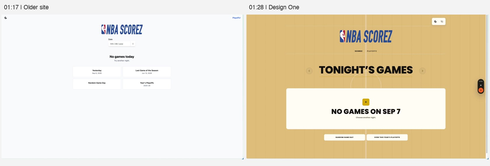
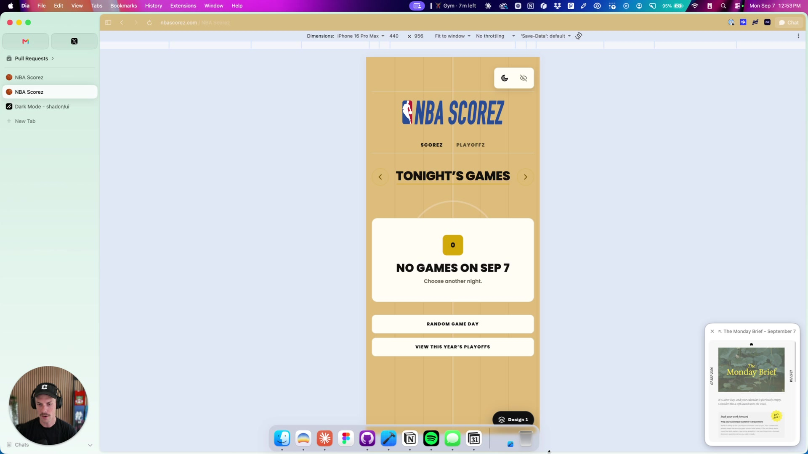
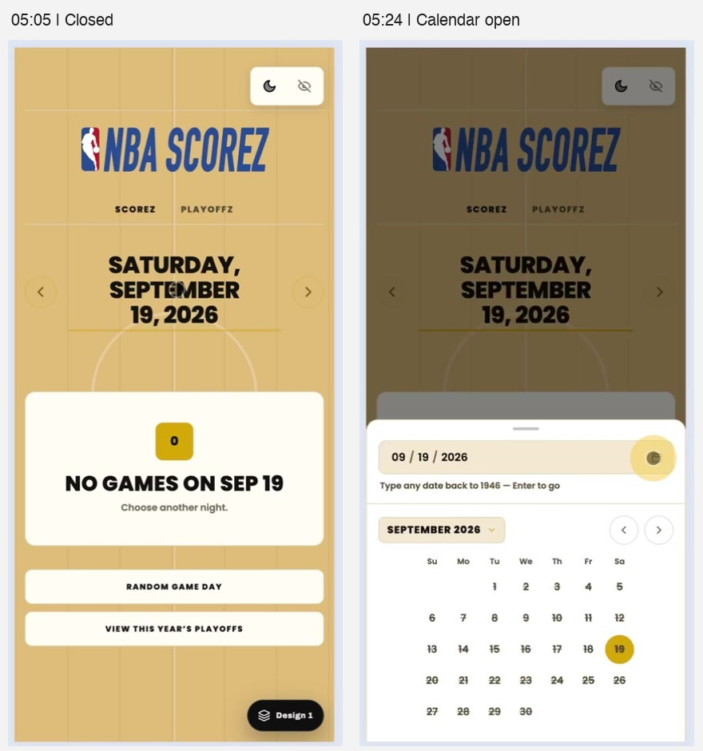
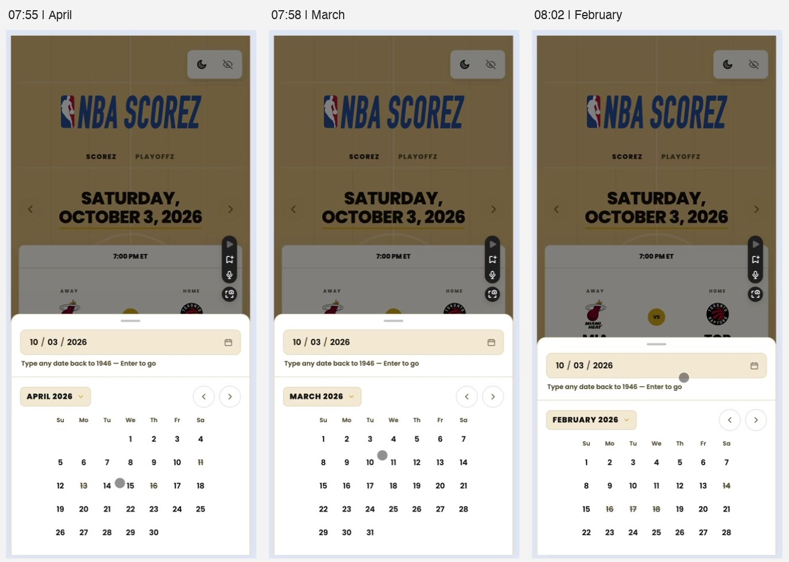
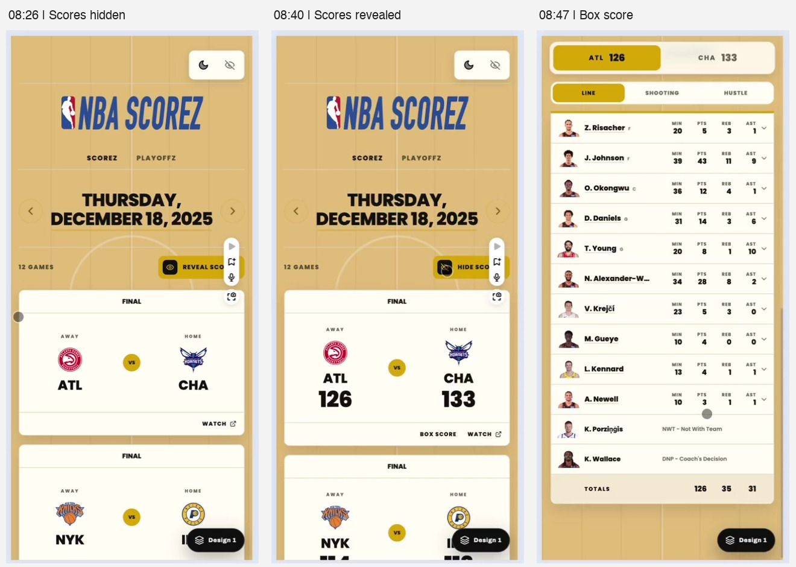
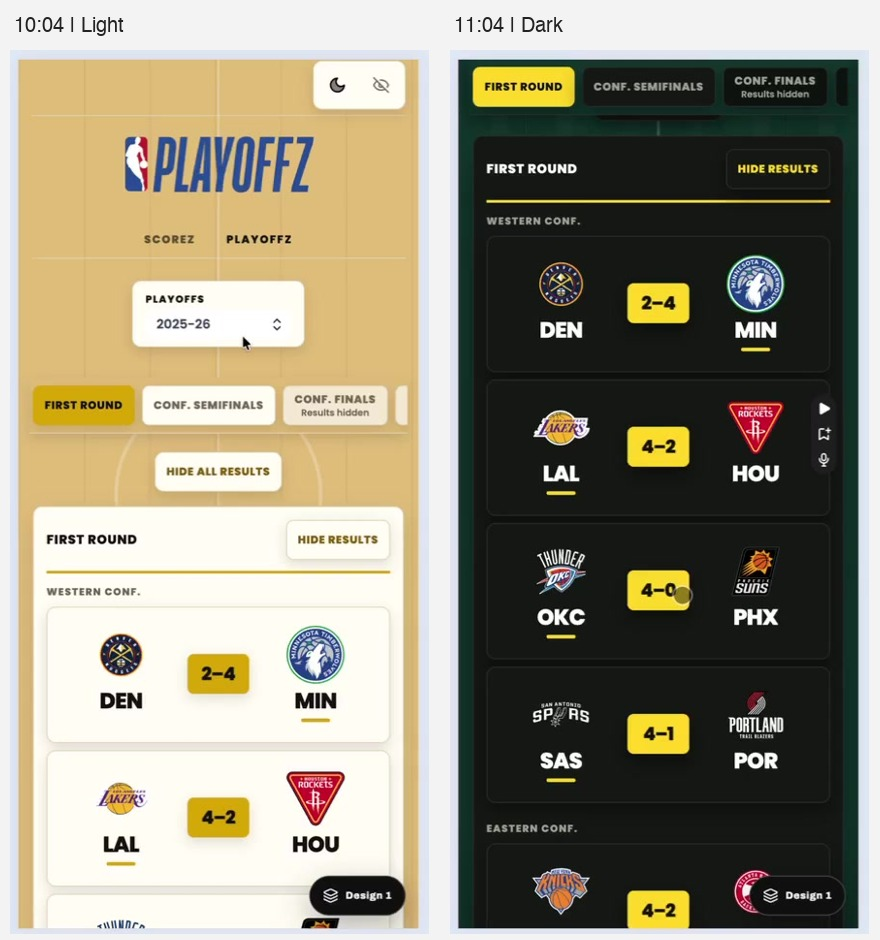

# Andy's visual review

[Feedback register](README.md) · [Full transcript](andy-transcript.md) · [Original Loom](https://www.loom.com/share/1dededea2de34d758d81fe2e66770304)

Frames extracted from the Loom's accessible playback stream on 2026-09-08. The comparison images contain labeled crops of the recording, not recreated designs. Links to full frames preserve the surrounding context. Timestamps are approximate to the decoded video frame.

The recording compares the older white NBA Scorez site with the gold court Design One preview. Most interaction critiques after 03:45 concern Design One. These are observations of the recorded version, not a reproduction against today's working tree. Some frames contain revealed results.

## 1. Older site versus Design One: proportion and personality

[Play from 01:17](https://www.loom.com/share/1dededea2de34d758d81fe2e66770304?t=77)

Full frames: [01:17](evidence/andy-0077.jpg), [01:28](evidence/andy-0088.jpg).

The older site has a small centered date input and compact empty-state actions surrounded by white space. Design One has a court background, a much larger date headline, and a wide empty-state card. Andy prefers the older version's proportions but calls it bland. He likes Design One's color and basketball identity, while describing some elements as oversized and youthful.

The old empty state visibly includes **Last Game of the Season**, alongside Yesterday, Random Game Day, and Year's Playoffs. Design One shows Random Game Day and View This Year's Playoffs. This gives the offseason navigation feedback a concrete reference. The old shortcut's existence does not establish that it works correctly now or that it is equivalent to a latest-game shortcut for a selected team.

Interpretation for review: separate compact proportions from the decision to retain or remove the court identity. Andy does not reject every part of Design One.

## 2. Theme icon: reference comparison, not an agreed size

[Play from 02:26](https://www.loom.com/share/1dededea2de34d758d81fe2e66770304?t=146)

Full frames: [older site on mobile, 02:26](evidence/andy-0146.jpg), [shadcn inspection, 03:24](evidence/andy-0204.jpg), [return to Design One, 03:48](evidence/andy-0228.jpg).

Andy initially questions the theme icon's stroke, then reconsiders whether its size is the issue. He inspects shadcn's dark-mode example and distinguishes the icon from the surrounding button area. His critique starts while the older site is visible, then he returns to Design One. Do not turn this into a confirmed Design One stroke-width defect or an instruction to install shadcn.

Interpretation for review: assess perceived icon weight and size together. His reference dimensions are examples, not acceptance criteria.

## 3. Mobile space and action discovery

[Play from 04:02](https://www.loom.com/share/1dededea2de34d758d81fe2e66770304?t=242)

The logo, navigation, headline, and empty-state card precede the two recovery buttons. Andy says those buttons fell outside the initial view on his own phone. They are visible in this recorded emulator frame, so the recording supports a reported smaller-phone concern, not proof that all mobile viewports hide them. His earlier mention of Scorez/Playoffz legibility is separate from the lower empty-state action buttons.

Interpretation for review: check real viewport heights and control legibility before choosing what to compress.

## 4. The calendar is discoverable only after an accidental click

[Play from 04:39](https://www.loom.com/share/1dededea2de34d758d81fe2e66770304?t=279)

Full frames: [05:05](evidence/andy-0305.jpg), [05:24](evidence/andy-0324.jpg), [05:44](evidence/andy-0344.jpg).

The closed view presents the date as a large heading between arrows. Clicking it opens a bottom sheet. A calendar icon exists inside that sheet, but Andy wants an obvious calendar affordance before opening it. He also clicks the icon inside the input and reports no action.

He questions repeated date information above the calendar divider. However, the typed/selected date and the month being browsed can differ, as the later month-navigation frames show. Simplifying that area should preserve a clear distinction between selection and browsing.

Interpretation for review: make the entry point obvious, then decide whether the inner icon should act or be clearly decorative.

## 5. Game-day marks are ambiguous

[Play from 05:49](https://www.loom.com/share/1dededea2de34d758d81fe2e66770304?t=349)

Full frames: [September, 06:02](evidence/andy-0362.jpg), [October, 07:28](evidence/andy-0448.jpg).

Andy first interprets the marks as dates he cannot navigate to, then reasons that they relate to game availability. He eventually finds a game. He mentions FotMob from his phone and suggests a dot beneath dates as an alternative. FotMob's calendar is not shown in these captured frames; his description of it is spoken reference material.

Interpretation for review: the demonstrated issue is uncertainty about what a mark means. The dot is one proposed solution. Do not infer the exact meaning of every current mark from the transcript alone.

## 6. Month navigation changes position

[Play from 07:50](https://www.loom.com/share/1dededea2de34d758d81fe2e66770304?t=470)

Full frames: [07:55](evidence/andy-0475.jpg), [07:58](evidence/andy-0478.jpg), [08:02](evidence/andy-0482.jpg).

The calendar grid changes height between months with different numbers of week rows. Because the sheet is anchored at the bottom, its header and month arrows move vertically. This resolves the transcript's vague reference to constantly shifting buttons: he is discussing the calendar sheet, not just the large date headline on the page.

Interpretation for review: keep month-navigation controls in a stable position during repeated taps. A fixed six-week grid or stable sheet height are possible implementations, still undecided.

## 7. Card behavior, spoiler controls, and boxscore access

[Play from 07:46](https://www.loom.com/share/1dededea2de34d758d81fe2e66770304?t=466)

Upcoming game: [07:50 full frame](evidence/andy-0470.jpg). Andy expects the card to open something, but it does not.

Full frames: [08:26](evidence/andy-0506.jpg), [08:40](evidence/andy-0520.jpg), [08:47](evidence/andy-0527.jpg).

For the historical game, the hidden state shows team identities and a Watch action. After reveal, numeric scores and a Box score action are visible. He opens the boxscore and reacts positively. His initial inability to find the score, his expectation that the card is clickable, and his disagreement with hiding past results are separate observations.

Brian likes spoiler protection, and PRODUCT.md explicitly makes it a product principle. A candidate response is clearer reveal controls and clearer paths into game details while retaining spoiler protection. Revealing scores by default would be a separate product decision, not an automatic usability fix.

## 8. Court styling and playoff depth

[Play from 09:07](https://www.loom.com/share/1dededea2de34d758d81fe2e66770304?t=547)

Court on the scores page: [09:40 full frame](evidence/andy-0580.jpg).

Full frames: [10:04 light](evidence/andy-0604.jpg), [10:35 scrolled light](evidence/andy-0635.jpg), [11:04 dark](evidence/andy-0664.jpg).

Andy compares the court styling to early iPhone interfaces with physical textures, then states a preference for simpler, flatter UI. On the playoff page, he says the layout generally feels good, but the nested round panels and matchup cards have excessive shadow/depth treatment. He suggests surface tones to distinguish levels, including in dark mode. The light and dark captures show different scroll positions; use them to inspect treatment, not to compare identical matchups or spacing.

Abhi's fixed-background complaint and light-mode contrast complaint are related, but they are distinct from Andy's preference for flatter styling. Neither proves that the court identity itself must go.

## 9. Reference tools and Andy's own app

Full frames: [searching for Interface Craft, 11:50](evidence/andy-0710.jpg), [Interface Craft's guide index, 12:20](evidence/andy-0740.jpg), [Jakub's skills, 13:10](evidence/andy-0790.jpg), [searching for Emil's material, 13:50](evidence/andy-0830.jpg), [StatSide discussion, 15:15](evidence/andy-0915.jpg).

The final portion is largely tooling advice and context about Andy's own app. The transcript preserves Interface Craft, Jakub's skills, Emil's animation material, skills.sh, and StatSide. They are reference suggestions, not requests to install software or add NFL, NHL, or MLB to NBA Scorez. His multi-sport plans should not be confused with Brian's ABA/FIBA request.
