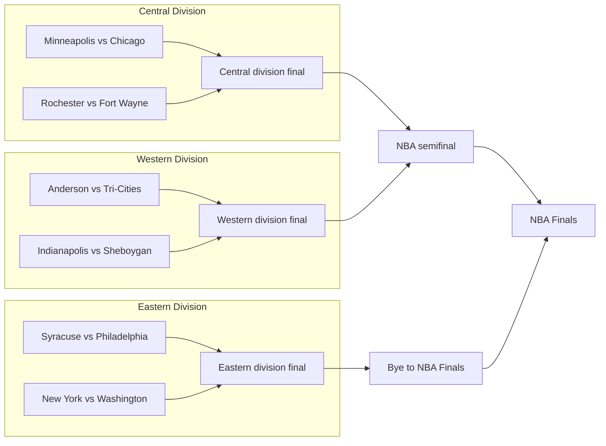

# Historical playoff layouts

Reviewed September 4, 2026. Proposal only; no application code changed.

The recommended direction is a small set of layouts selected by tournament format. Keep the Hardwood colors, typography, cards, season navigation, and result controls. Make the structure explain who advances, which stage comes next, and why a team skips a stage.

The audience is a fan exploring an unfamiliar season. They should be able to trace a route to the championship without already knowing that year's rules. Treat this page primarily as a reading experience with series links and optional result reveals.

## Review scope

Inspected the supplied design-1 playoff preview at 1280 × 800, 1600 × 1000, and 390 × 844 for 1949-50. Also inspected desktop views of 1946-47, 1953-54, and 1954-55. Read live API responses for those seasons plus 1947-48, 1948-49, 1974-75, and 1976-77. Both hidden and shown result states appeared during the review; this was not an exhaustive interaction test.

The frontend and backend already contain substantial local changes. This plan describes the working tree as reviewed. The format-specific direction is a recommendation, pending the owner's preference; it is not a confirmed design decision.

## What is making the page confusing

| Finding | Evidence in the current app | Consequence |
| --- | --- | --- |
| Historical membership uses today's conference map | `get_group_for_series` calls `_get_series_conference`, which returns the first recognized team's current East/West membership. The 1950 response has Western, Eastern, and League groups, but no Central Division. | Teams appear in the wrong branch. Some paths cross groups or disappear. |
| Different stages share one round number | In 1949-50, Minneapolis vs. Chicago, Fort Wayne, and Anderson all arrive as round 2, labeled Conference Semifinals. | Successive matchups look like alternatives in the same round. Hidden results still expose later opponents. |
| Repeated opponents are combined across stages | In 1953-54, Minneapolis/Rochester contains March 17 plus March 24, 27, and 28. Boston/Syracuse contains March 17, 22, 25, and 27. Each is one First Round record. | Pool games and division-final games lose their separate meaning. The division-finals stage is absent. |
| A format flag overstates correctness | 1954-55 is marked `supportsExactBracket: true`, but both division finals are placed in the Eastern group. Its opening series receive `targetWins: 4`. | An apparently authoritative tree can still be wrong. Series-length labels cannot be trusted just because the format is recognized. |
| Nonstandard formats become disconnected sections | The desktop renderer draws connectors only for the exact mirrored layout. Other modes stack groups and put the Finals below them. | The reader must remember winners and reconstruct progression while scrolling. |
| One breakpoint decides whether any bracket is available | Below 1440px, design-1 always renders `MobileBracket`. At 1280px the first 1950 card spans roughly 1116px and is 175px tall. | A laptop gets a long sequence of oversized cards even when a smaller historical bracket would fit. |
| Reveal rules assume one global sequence | In 1946-47, the division-winners matchup says to reveal Quarterfinals first, even though its participants qualified independently. | Known participants are hidden unnecessarily while other seasons leak advancing teams. |
| Historic identities are hard to recognize | Cards show tricodes such as INO and TCB; several defunct-team logo requests failed during the review. | Readers need prior knowledge to identify unfamiliar teams. |

The data defects are prerequisites for a trustworthy visual change. Adding lines to today's 1950 cards would illustrate the wrong tournament.

## Proposed 1949-50 layout

Use three compact division brackets feeding a shared championship section. Read left to right on a wide screen. Keep the Eastern path visually separate from the Central/Western merge so the bye is immediately understandable.

The historical structure was three four-team divisions. Central champion Minneapolis played Western champion Anderson in an NBA semifinal; Eastern champion Syracuse advanced directly to the Finals. [1950 tournament format](https://en.wikipedia.org/wiki/1950_NBA_playoffs), [series and stage results](https://www.basketball-reference.com/playoffs/NBA_1950.html).

This sketch uses structural placeholders so it also describes the hidden-results view:

Use the stage headings **Division semifinals → Division finals → NBA semifinal → NBA Finals**. Show a bye as a short labeled connection, not an empty matchup card or an opponent named BYE. Position the Finals at the end of both paths.

Place a short format explanation beside the season picker: "Three divisions. One division champion received a bye to the NBA Finals; the other two played a semifinal." An expanded explanation can describe the selection rule. Keep the recipient's identity behind the relevant result dependency. A permanently visible connection to a particular division must also be checked against what was knowable before the playoffs; use a generic bye destination if that connection itself reveals an outcome.

On a laptop, stack the three division sections vertically, but retain each small two-column bracket. Follow them with a connected championship section and labeled destinations such as "Winner advances to NBA semifinal." On a phone, use the same section order with compact vertical paths and links to the next stage. Do not require horizontal panning to understand advancement.

## Other formats need different structures

| Seasons | Proposed display | Detail that must remain clear |
| --- | --- | --- |
| 1946-47 and 1947-48 | Two unequal qualifying paths meeting at the Finals | Division winners play one series for a Finals place. Second- and third-place teams play two rounds for the other place. The division-winners matchup is available from the start. [1947 bracket](https://en.wikipedia.org/wiki/1947_BAA_playoffs). |
| 1948-49 and the early 1950s with eight qualifiers | Compact two-division tree | Use season-correct division membership and stage names. Derive height from the actual number of matchups. |
| 1953-54 | Two pool tables, then division finals, then NBA Finals | Three teams per pool; two advance. Pool results are standings, not elimination series. [1954 format](https://www.nba.com/news/history-season-review-1953-54). |
| 1954-55 through 1965-66 | Two division paths with explicit opening byes | Show the waiting team at its entry stage, with a "First-round bye" note. The 1955 division finals were best of five. [1955 bracket](https://en.wikipedia.org/wiki/1955_NBA_playoffs). Verify each season's series lengths separately. |
| 1974-75 through 1982-83 | Conference trees with explicit entry points | Ten-team and twelve-team fields need different opening stages. Both require historically correct conference membership and bye assignments. |
| Conventional later brackets | Retain the familiar mirrored tree | Reuse the shared cards, progression model, and responsive rules. |

For 1954, put Team, Played, Wins, and Losses in each pool table, with a clear advancement mark after reveal. Link to the pool's games underneath. Hide outcome-based ordering, records, and qualification marks until revealed. Use regular-season seed order or another fixed order while hidden.

Separate the pool fixtures from the later elimination series before calculating standings. The Western pool had an unplayed Minneapolis/Rochester fixture after both teams qualified, so unequal games played are valid. Never invent a missing result to complete a rectangular table. [1954 pool schedule and division finals](https://en.wikipedia.org/wiki/1954_NBA_playoffs).

## Shared interaction and visual rules

- Show full historical team names where these small fields leave room. Tricodes can remain secondary. A failed logo must leave a readable team identity and a stable card size. Coordinate with the existing historical-logo work rather than starting another asset overhaul.
- Use one format explanation. Replace the current general warning with the actual rule. If a specific record is uncertain, label that record "Progression not confirmed" and show its dated games without an asserted advancement line.
- Separate participant visibility from result visibility. A known starting team can appear with hidden results. A later participant appears only after its qualifying result has been revealed. This applies to text, logos, accessible names, link destinations, standings order, and advancement highlights.
- Keep Show all / Hide all and clear stage controls. Independent BAA paths should reveal independently. Hiding a result must hide the participants and results that depend on it, while leaving unrelated paths alone.
- A connector describes a verified relationship between stages. It must not imply a winner while results are hidden. For pools and conditional byes, represent qualification rules explicitly instead of guessing edges from the winning team.
- Use the same presentation plan on desktop and mobile. Choose the arrangement from available container width and the number of stages, rather than applying a universal 1440px cutoff.
- Keep visible reading order and keyboard order aligned. Give advancement links descriptive names and preserve focus after reveal. Provide text destinations alongside decorative lines. Retain at least 44px targets and reduced-motion behavior.
- Keep the current Hardwood visual language. Gold remains useful for active controls and revealed outcomes. Extra team-color panels, a new navigation system, and a general page redesign are outside this proposal.

## Implementation sequence

### 1. Correct historical stages and membership

Start with 1949-50 as the first complete slice, then fix 1953-54 and the other representative formats.

In `server/services/playoffs.py`, introduce season-aware membership and explicit format definitions. Separate a stage's identity, display order, type, and series length from the legacy numeric round. A stage may be elimination, pool play, or qualification by bye. A verified season override is appropriate for an exceptional year when supported by cited records.

Assign games to stages before aggregating series. The same pair of teams can meet in pool play and a later elimination series. Keep game IDs intact; give each stage-specific matchup a stable identity. Distinguish postseason seeding tiebreakers from elimination series if those games are present.

Return explicit participant sources and advancement rules. Sources can be an initial team, a preceding series winner, a pool qualifier, or a verified bye. Record evidence separately from presentation style. A recognized era must not automatically certify every series or edge.

Audit 1948-49, 1954-55, 1974-75, and 1976-77 membership as part of this change. The live responses show that the problem extends beyond the exceptional 1950 format. In 1974-75, Chicago/Kansas City and Washington/Buffalo are placed in round 1 despite their longer game sequences, so bye-aware stage assignment also needs review.

Add regression fixtures to the existing backend test suite using independently checked games and stages, not only synthetic format flags. Verify each game belongs to one stage, repeated opponents remain separate, byes create no games, and all advancement references resolve.

### 2. Build one presentation model for historical formats

Extend the shared types in `src/helpers/helpers.tsx`, `playoffBracketModel.ts`, and `bracketPresentationPlanner.ts`. Add explicit support for three-division paths, unequal qualifying paths, pool stages, and bye entry points. Keep the conventional mirrored layout. Retain a dated-game list for genuinely unresolved records.

Replace the fixed seven-row positioning for historical trees with positioning based on actual feeders. A destination should sit between its inputs, with enough space for the rendered card heights. Keep verified partial paths visible even if another section is unresolved.

Update `useBracketReveal.ts` to follow participant dependencies rather than assuming that all smaller round numbers are prerequisites. Preserve the global visibility preference and clear season-specific reveal state on season changes. Add tests for hidden initial participants, independent paths, conditional byes, and hiding downstream outcomes.

Review `seriesSlug.ts` and `useSeriesPage.ts` as part of the data migration. Their current routing uses numeric rounds and group order. Keep existing unambiguous links working through aliases; do not silently redirect a formerly combined pool/series link to the wrong stage. A legacy ambiguous link can show a choice between the relevant stages.

### 3. Implement the 1950 view, then reuse its parts

In `Design1PlayoffBracket.tsx`, add the three-division arrangement and shared championship section. Reuse `BracketSeriesCard`, but allow full historical names and explicit stage labels. Add a small bye annotation component and a pool-table component when implementing 1954.

Make `MobileBracket.tsx` consume the same planned paths. Preserve useful small brackets on laptop screens; use vertical paths on narrow phones. Collapse only optional game detail, not the essential route to the next stage. If shared components affect the original design, regression-check that route too.

Complete 1950 first. Then apply the same participant/dependency model to early BAA paths, 1954 pools, and the six-, ten-, and twelve-team bye formats.

### 4. Verify historical meaning and browsing behavior

| Fixture | Acceptance check |
| --- | --- |
| 1949-50 | Three correctly named divisions; six division semifinals, three division finals, one NBA semifinal, and one Finals series. The bye is explicit. Initial hidden state does not expose Minneapolis's later opponents. |
| 1946-47 and 1947-48 | Two unequal paths. Initial division-winners participants are visible without revealing the other path. Finals participants remain hidden until their own prerequisites are revealed. |
| 1953-54 | Pool fixtures and division-final games are separate. Two qualifiers per pool. Eleven played pool games, two division-final series, and one Finals series. No invented result for the unplayed fixture. |
| 1954-55 | A division final on each side; two explicit opening byes. Correct best-of-three opening series and best-of-five division finals. |
| 1948-49, 1974-75, 1976-77 | Season-correct membership and stage assignment, including teams whose present-day conference differs. |
| One complete modern season and an incomplete current fixture | Existing mirrored behavior, empty slots, and result preferences remain usable. |

Run the relevant backend tests, the planner/model/reveal/route/component Vitest tests, `pnpm lint`, and `pnpm build` after implementation. Vitest is already installed despite the older AGENTS.md testing note.

Visually check 390px phone, 768px tablet, 1280px laptop, and 1600px desktop widths in light and dark mode. Inspect hidden, partly revealed, and fully revealed states; long names; missing logos; keyboard navigation; zoom; and season changes. No horizontal page overflow, overlapping cards, decorative dead-end connectors, or unexplained empty rounds.

The practical completion test is whether someone can identify the starting field, explain a bye or pool qualification, and trace either Finals participant's route without opening a history article.

## Handoff

This document is the design and implementation proposal. The first implementation milestone should be correct, readable 1949-50 paths across desktop and mobile. The other formats follow once the common model works. No build or tests were run for this planning-only change.

Beads records the review as `nba-scores-86f` and the remaining implementation as `nba-scores-ptb`. Changes to this document and issue metadata are local and uncommitted.
